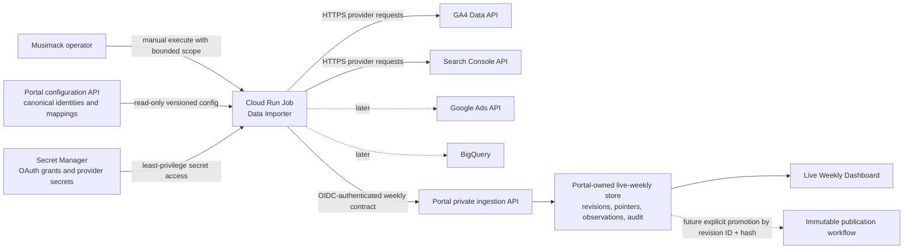

# Target cloud architecture

## Smallest secure production design

The first pilot uses one job execution, one task, one project/provider/week at a time, no scheduling, and no parallel provider fan-out. This matches the current operator capacity and keeps request ceilings, logs, failure recovery, and acceptance evidence legible.

## Execution target comparison

| Target                      | Fit                | Advantages                                                                                                                                          | Disadvantages                                                                                                                              | Decision                                                              |
| --------------------------- | ------------------ | --------------------------------------------------------------------------------------------------------------------------------------------------- | ------------------------------------------------------------------------------------------------------------------------------------------ | --------------------------------------------------------------------- |
| Cloud Run Jobs              | Strong             | Bounded one-shot execution, container/local parity, manual execution, workload identity, Secret Manager integration, per-execution logs, no idle VM | Requires containerization and noninteractive credentials; task timeout/retry settings must be explicit                                     | **Recommended**                                                       |
| Dedicated Compute Engine VM | Possible           | Familiar long-lived disk and process model; simplest lift for mutable token files                                                                   | Patch/process supervision, persistent secret risk, idle cost, drift, larger blast radius                                                   | Reject for pilot unless a proven runtime dependency cannot be removed |
| Portal VM                   | Poor               | No new compute resource                                                                                                                             | Co-locates provider grants with public app and database, couples failures/deployments, expands blast radius, undermines ownership boundary | **Reject**                                                            |
| Cloud Run service           | Weak for retrieval | Useful for HTTP ingress                                                                                                                             | Long-lived service shape is unnecessary for bounded pulls; creates another public/request surface                                          | Use only if a future orchestration API truly needs it                 |
| Cloud Functions             | Weak               | Small deployment unit                                                                                                                               | Provider orchestration and reusable CLI logic fit a container job better                                                                   | Reject                                                                |
| GKE / Batch                 | Excessive          | Advanced orchestration or massive parallelism                                                                                                       | Operational burden exceeds current scale                                                                                                   | Reject                                                                |
| Workflows                   | Later complement   | Can orchestrate approved job/API steps                                                                                                              | Does not replace provider runtime; adds state/complexity                                                                                   | Revisit after manual pilot                                            |

Cloud Run Jobs supports manual execution and later Scheduler invocation, configurable task timeout/retries, job-scoped service identity, structured Cloud Logging, and Secret Manager references. Configure the job rather than accepting platform defaults: one task, parallelism one, no automatic application-level retry in the pilot, and a bounded timeout sized from measured provider runs.

## GCP project structure

Recommended production layout:

- `musimack-reporting-ingestion-prod`: Cloud Run Job, Artifact Registry, importer service account, Secret Manager, job logs/alerts, and ingestion budget.
- existing Portal project: Portal VM/service, Portal identity validation configuration, database connectivity, Portal logs, and publications.
- existing/client BigQuery projects: source datasets remain where exports and clients own them; the importer service account receives dataset-level read grants and creates query jobs in an explicitly selected billing project.
- a separate `musimack-reporting-ingestion-dev` project before unattended scheduling or real multi-client testing.

### Alternatives

| Choice                                             | Advantages                                                                            | Risks / migration implications                                                                  |
| -------------------------------------------------- | ------------------------------------------------------------------------------------- | ----------------------------------------------------------------------------------------------- |
| Dedicated ingestion project                        | Clear billing and IAM boundary; limits Portal compromise; easy environment separation | Cross-project IAM and token audience setup                                                      |
| Existing Portal project                            | Fewer projects and simpler initial IAM                                                | Provider secrets and public Portal share a blast radius; harder cost attribution                |
| Existing BigQuery project                          | Convenient for BigQuery jobs                                                          | Couples GA4/GSC runtime and secrets to analytics billing/data ownership                         |
| New reporting-data project holding copied datasets | Central governance                                                                    | Premature copying, retention, residency, and cost decisions; do not do this for the first pilot |

The dedicated project is recommended, but `PO-001` must approve it before resources are created.

## Job lifecycle

1. Operator selects exact environment, Portal project UUID, provider, Monday week start, authorization envelope, and configuration version.
2. Job validates that it is not pointed at production when running in local/dev mode and that the requested profile is explicitly authorized.
3. Job fetches the Portal's sanitized configuration record and verifies its version/status.
4. Job begins a Portal refresh run using a unique idempotency key.
5. Job resolves only the required Secret Manager versions.
6. Job runs one bounded provider retrieval with measured request counting.
7. Job normalizes, validates, canonicalizes, hashes, and logs a safe summary.
8. Job completes the Portal run with the weekly contract, or records a classified safe failure.
9. Job exits deterministically. The Portal response is the persistence authority.

The Cloud Run filesystem is temporary. The production path must not depend on files surviving between executions. Fixtures and transient canonical payload files may use the job's temporary filesystem, but successful delivery and audit evidence must be in the Portal database and Cloud Logging. OAuth refresh must not update a local token cache.

## Manual pilot deployment shape

- immutable image digest, not a floating tag;
- one region aligned with Portal/BigQuery residency where known;
- dedicated runtime service account;
- no public HTTP listener;
- CPU/memory sized from test evidence;
- task timeout and request ceilings explicitly configured;
- zero platform retries initially; operator performs a deliberate rerun with a new trigger identity while idempotency protects replays;
- execution arguments contain resource UUIDs and non-secret contract choices only;
- secrets accessed by exact version or a controlled alias, not embedded in environment definitions, images, or ordinary JSON;
- manual run evidence retained before any scheduler work.

## Deployment independence

The ingestion contract is versioned independently of Portal schema migrations and importer releases. The Portal advertises supported contract versions. The importer refuses an unsupported version before provider calls. Additive optional fields may ship independently; required-field or semantic changes require a new contract major version and a compatibility window.

## Rejected direct coupling

The importer must not receive Portal database credentials, import Portal Rust store code, or run Portal migrations. The Portal must not import Python provider modules, mount provider secrets, or call providers in API requests. Shared behavior is expressed through versioned contracts and conformance fixtures, not copied persistence logic.
