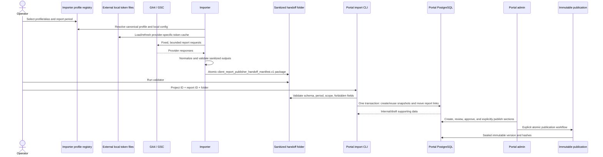
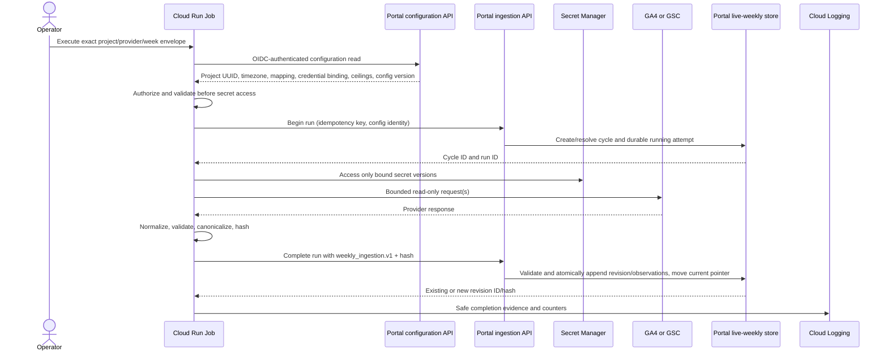
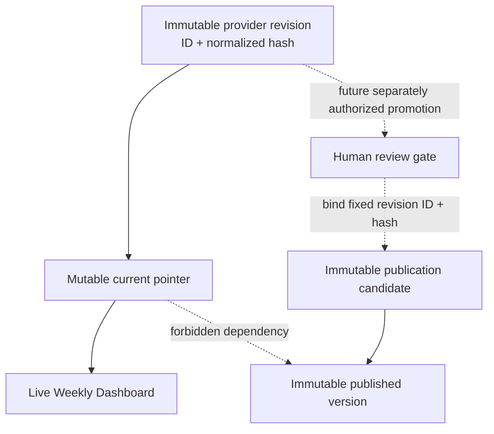

# Data flow and sequence diagrams

## Current Phase 1 local report workflow

Phase 1 identity is report-scoped and file-mediated. The Portal importer receives explicit project/report UUIDs; the manifest mainly supplies a client slug and period. A governed digest makes identical re-import idempotent. Changed input creates a new immutable integration snapshot rather than rewriting the old snapshot. Publication remains a separate admin action.

## Target Phase 2 manual weekly workflow

If retrieval or normalization fails, the job calls the failure endpoint with a closed safe error code and request count. The Portal closes the run as failed and leaves the last valid current revision untouched.

## Target read and publication boundaries

The forbidden edge is the key rule: a publication never reads through a current pointer. Later weekly refreshes may change the dashboard, but cannot alter a published version.

## Data classification across the path

| Stage                       | Permitted                                                                                        | Forbidden                                                                            |
| --------------------------- | ------------------------------------------------------------------------------------------------ | ------------------------------------------------------------------------------------ |
| Provider response in memory | Raw response needed for normalization                                                            | Logs, Portal payloads, durable ungoverned dumps                                      |
| Normalized importer result  | Governed metrics, daily points, ranked rows, freshness/coverage, safe lineage                    | Tokens, headers, request/response bodies, local paths, OAuth values                  |
| Portal ingestion contract   | Canonical IDs, week, contract/config versions, counters, normalized hash, sanitized observations | Client secrets, refresh/access tokens, Secret Manager payloads, database credentials |
| Portal revision             | Immutable normalized observations and safe audit evidence                                        | Mutable provider payloads or credentials                                             |
| Client dashboard            | Backend-authorized display directive and governed metrics                                        | Raw lineage internals, credentials, arbitrary snapshot/revision selection            |
| Publication                 | Explicit fixed revision evidence only after future approval                                      | Current pointers, automatic promotion, mutable live data                             |

## Delivery and replay behavior

- Begin-run replay with the same project/provider/week/idempotency key returns the original run.
- Complete replay with the same run, contract version, and payload hash returns the existing revision.
- Complete replay with the same idempotency identity but a different hash returns `409 conflict` and moves no pointer.
- Validation failure returns `422`, records safe failure evidence where possible, and persists no revision observations.
- Authentication/authorization failure returns `401/403` before configuration or project details are disclosed.
- Unsupported contract returns `426` or `422` before provider calls when discovered in capability preflight.
- `429` and transient `5xx` are retryable only within the approved attempt policy; all other `4xx` are terminal for that payload.
