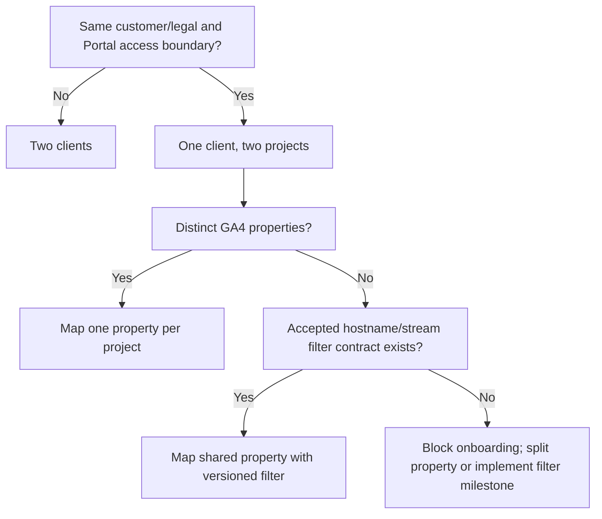

# Governed new-client onboarding workflow

## Standard workflow

1. Find an existing canonical Portal client by durable identity; create one only when it is a genuinely new customer boundary.
2. Create a Portal project with durable UUID, governed slug, name, root domain, allowed hosts, and default-deny access.
3. Assign an IANA reporting timezone and verify Monday-through-Sunday resolution.
4. Record website/domain and any approved hostname/stream isolation rule.
5. Record the GA4 property mapping once in the Portal configuration aggregate.
6. Record the exact Search Console property identity and type once.
7. Later record Google Ads customer and optional login-customer IDs.
8. Later record BigQuery billing/source project, dataset, location, allowed views/tables, and metric contract.
9. Select an existing credential binding or complete a separate OAuth/service-account grant; store only the secret in Secret Manager.
10. Run metadata-only configuration readiness: identities, versions, enabled state, scope class, secret presence, and IAM presence without reading provider data.
11. Run one-call permission probes inside an approved numerical ceiling and record only safe status/cost evidence.
12. Run one bounded manual provider import for a completed Monday-through-Sunday week.
13. Validate normalized metric, daily, ranked, coverage, freshness, request-count, and hash contracts.
14. Validate Portal ingestion: project isolation, idempotency, revision history, current pointer, failure containment, and dashboard display.
15. David completes the manual-operation Human Acceptance Gate for that client/project/provider.
16. Scheduling remains disabled until the separate global and per-project scheduling gates close.

At every step, ambiguity fails closed. A client name/domain match does not automatically merge records. A provider resource is not enabled until project ownership, authorization, and credential access are proven.

## Readiness states

```text
draft -> identity_ready -> credential_ready -> permission_verified
      -> manual_pilot_ready -> manual_accepted -> scheduling_eligible
```

`scheduling_eligible` is not `scheduled`; the global P2-OPS-F06/P2-8 gates and a project schedule record are still required. Regressions such as revocation move the provider to `permission_required` or `configuration_required`, not a false zero/empty state.

## Initial onboarding recommendations

| Identity                  | Recommended Portal model                           | Provider isolation note                                                                                           |
| ------------------------- | -------------------------------------------------- | ----------------------------------------------------------------------------------------------------------------- |
| Cain Dentures             | One client, at least one website/reporting project | Confirm exact legal name, domain, timezone, GA4 property, and GSC property before mapping                         |
| Coin Meter                | One `Coin Meter` client, primary project           | Confirm whether access/contract boundary is shared with Support Portal                                            |
| Coin Meter Support Portal | Second project under Coin Meter by default         | Separate GA4 property preferred; shared property blocks ingestion without accepted hostname/stream filter         |
| Cascade Fresh             | One client, at least one project                   | Confirm name/domain collision with any existing fixture or similarly named entity; never reuse a fixture identity |

These are model recommendations, not record-creation authorization. Exact domains, IDs, provider resources, and access assignments were not available in repository evidence and must be supplied through the governed onboarding workflow.

## Coin Meter decision tree



One project with two provider resources is rejected for the default case because it collapses two dashboard/access/reporting contexts. Shared credentials do not justify shared project identity.

## Permission probes

- GA4: metadata/property accessibility or the smallest fixed report request; no broad date range.
- GSC: exact property permission plus minimal bounded Search Analytics query when required.
- Google Ads: customer access/read-only query only after P2-5 authorization and developer-token status review.
- BigQuery: dataset metadata/read permission and dry-run estimate before any real query.

Each probe names the exact maximum request count and direct cost ceiling. A missing cost classification is a refusal, not an assumed zero.

## Onboarding acceptance checklist

- canonical client/project UUIDs and slug approved;
- timezone/domain/provider mappings complete and unambiguous;
- credential binding scope/revocation impact understood;
- readiness and probe evidence safe and successful;
- request ceilings stored and enforced;
- importer normalized fixture/conformance tests pass;
- Portal transaction and cross-client isolation tests pass;
- manual pilot creates/reuses correct revision and never touches a publication;
- client visibility decision applied separately by Portal governance;
- scheduler remains off.
